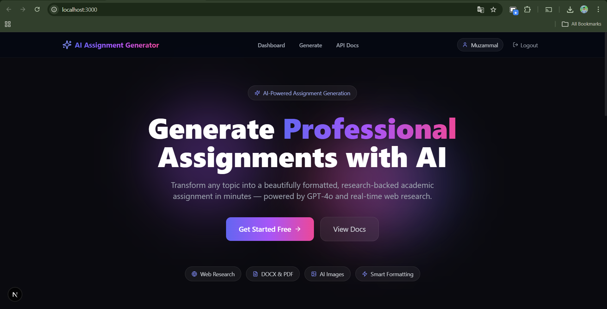
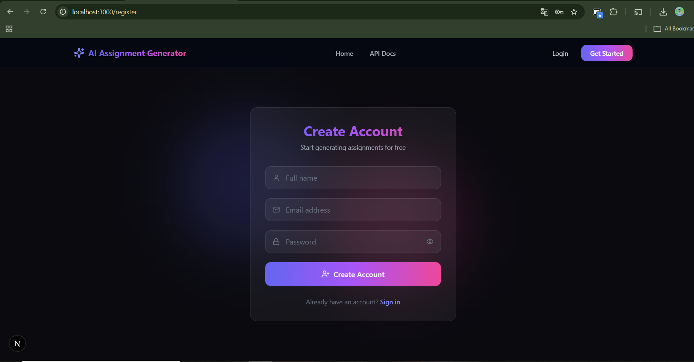
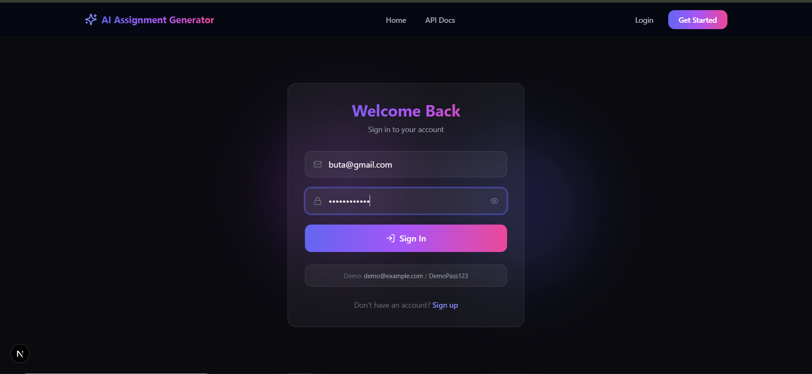
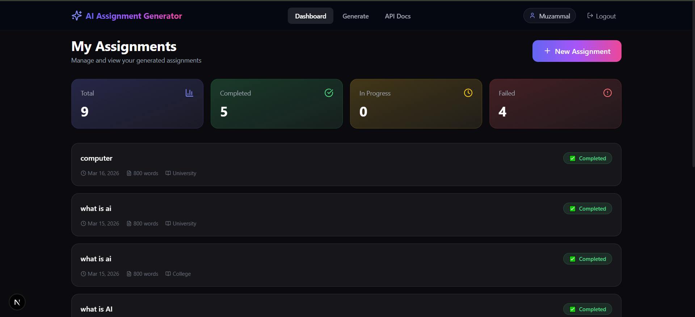
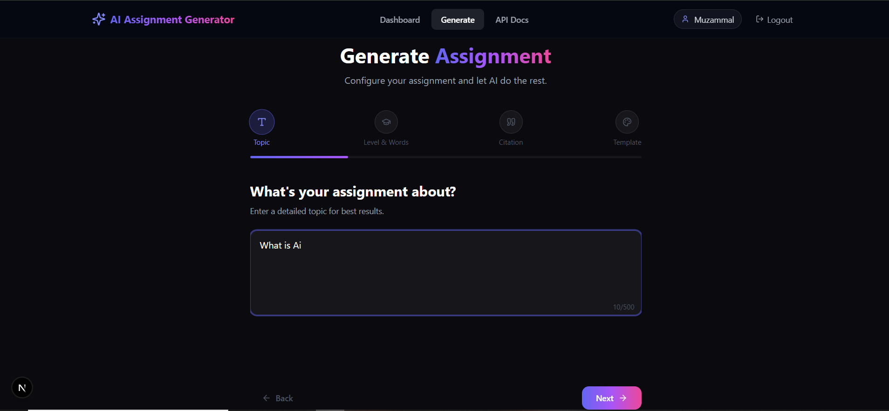
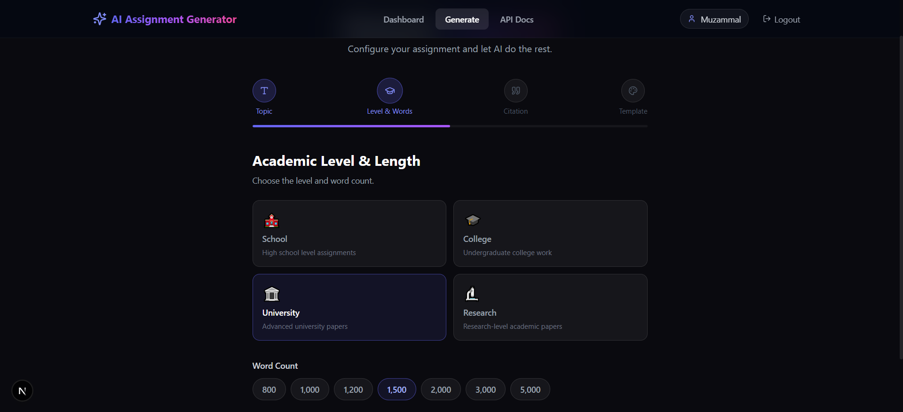
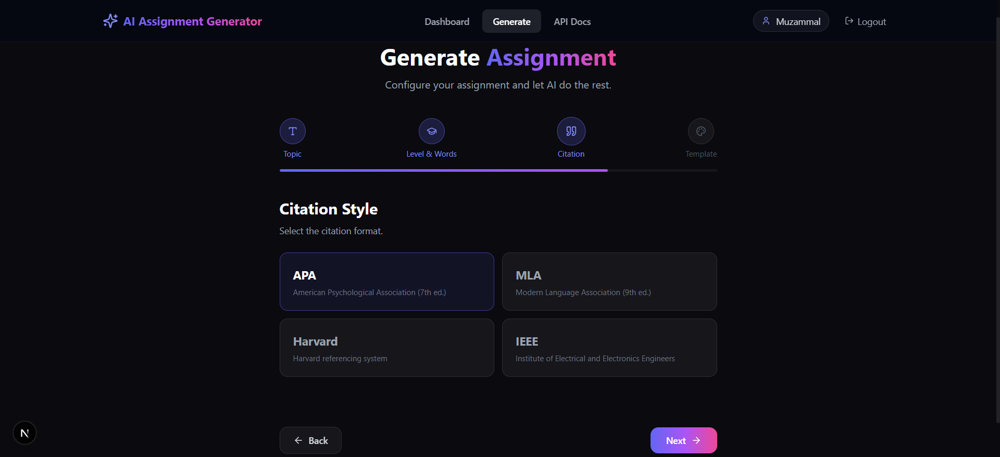
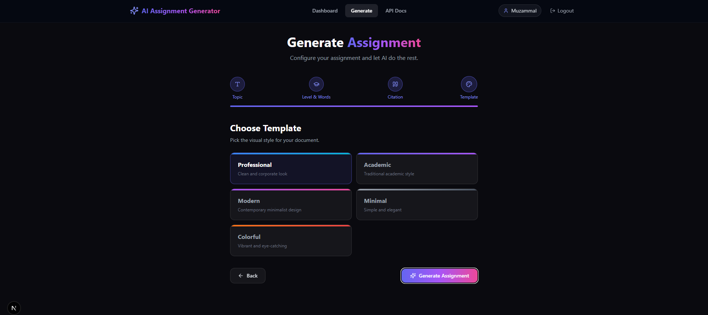
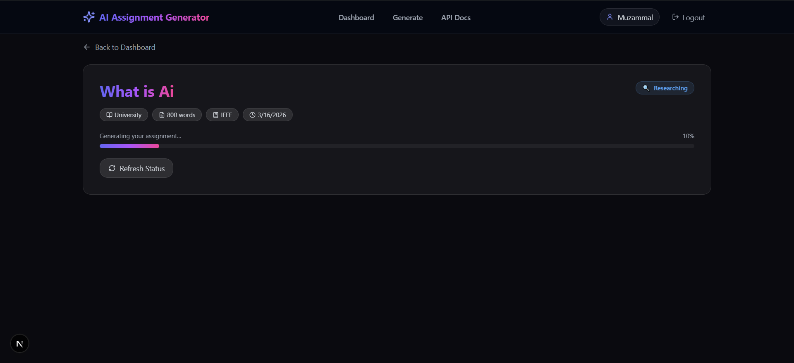
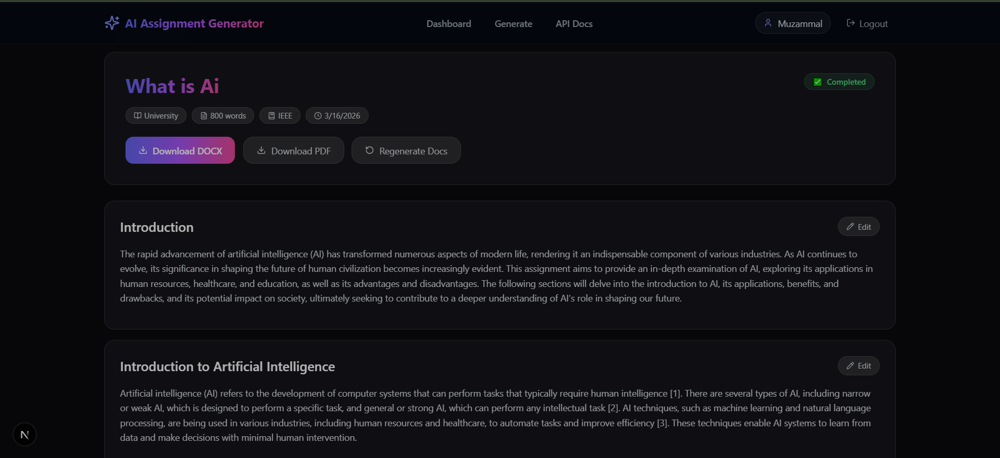

# AI Assignment Generator

AI Assignment Generator is a production-oriented full-stack application for creating structured academic assignments with AI-assisted writing, real-time research, and export-ready output.

## Executive Summary

- Full assignment pipeline: research, outline, writing, and document export.
- Secure authentication with JWT access and refresh tokens.
- Background job execution using Celery and Redis.
- Modern web interface built with Next.js.
- Integrated AI services for text and image generation.

## Core Features

- AI text generation via Groq
- Research enrichment via Tavily
- Contextual image generation via Google Gemini
- DOCX and PDF export support
- Input validation, prompt-guarding, and rate limiting
- User dashboard for assignment lifecycle management

## Architecture Overview

```text
Frontend (Next.js)
    |
    v
Backend API (Flask)
    |
    +--> Authentication and Authorization
    +--> Assignment Pipeline (Research -> Outline -> Draft -> Export)
    +--> Async Processing (Celery + Redis)
    |
    +--> External Integrations
          - Groq (LLM text generation)
          - Tavily (web research)
          - Gemini (image generation)
```

## Repository Structure

```text
ai-assignment-generator/
├── Backend/
│   ├── app/
│   │   ├── api/
│   │   ├── models/
│   │   ├── schemas/
│   │   ├── services/
│   │   ├── tasks/
│   │   ├── templates/
│   │   └── utils/
│   ├── config/
│   ├── migrations/
│   ├── scripts/
│   ├── tests/
│   ├── docker-compose.yml
│   └── requirements.txt
├── Frontend/
│   ├── src/app/
│   ├── src/components/
│   ├── src/hooks/
│   ├── src/lib/
│   └── package.json
├── img/
└── README.md
```

## API Reference

Base path: `/api/v1`

| Method | Endpoint | Authentication | Description |
| --- | --- | --- | --- |
| GET | /health | Not required | Service health check |
| POST | /auth/register | Not required | Register a new account |
| POST | /auth/login | Not required | Authenticate and issue tokens |
| POST | /auth/refresh | Refresh token | Renew access token |
| POST | /assignments/generate | Access token | Start assignment generation |
| GET | /assignments | Access token | List assignments for current user |
| GET | /assignments/{id} | Access token | Retrieve assignment details |
| GET | /assignments/{id}/download | Access token | Download generated output |

## Frontend Screenshots

### Landing, Authentication, and Generation

| Screen | Preview |
| --- | --- |
| Screen 1 |  |
| Screen 2 |  |
| Screen 3 |  |
| Screen 4 |  |
| Screen 5 |  |
| Screen 6 |  |

### Dashboard and Assignment Views

| Screen | Preview |
| --- | --- |
| Screen 7 |  |
| Screen 8 |  |
| Screen 9 |  |
| Screen 10 |  |
| Screen 11 |  |

## Local Setup

### Backend

```bash
cd Backend
python -m venv .venv
```

Linux/macOS:

```bash
source .venv/bin/activate
```

Windows PowerShell:

```powershell
.\.venv\Scripts\Activate.ps1
```

Install dependencies and start API:

```bash
pip install -r requirements.txt
cp .env.example .env
flask run --host=0.0.0.0 --port=5000 --reload
```

Start Celery worker (optional):

```bash
celery -A app.tasks.assignment_tasks.celery worker --loglevel=info --concurrency=4
```

### Frontend

```bash
cd Frontend
npm install
npm run dev
```

Default local endpoints:

- Frontend: http://localhost:3000
- Backend: http://localhost:5000

## Docker (Backend)

```bash
cd Backend
docker-compose up --build -d
docker-compose down -v
```

## Quality Checks

Backend:

```bash
cd Backend
pytest tests/ -v --cov=app --cov-report=html --cov-report=term-missing
```

Frontend:

```bash
cd Frontend
npm run lint
```

## License

MIT